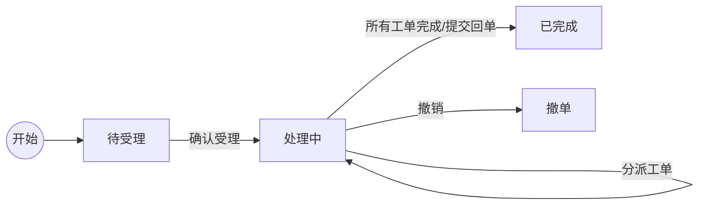
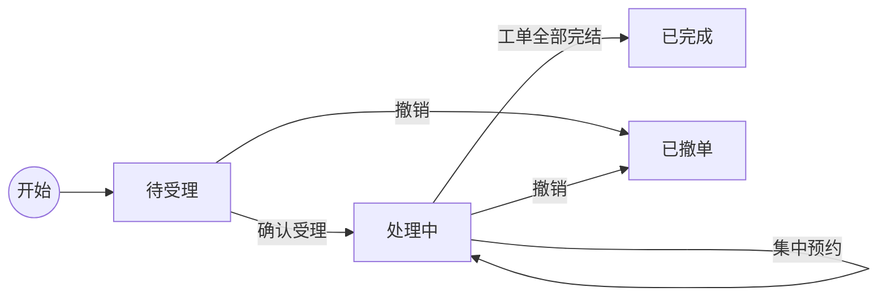

# 团单管理需求说明书 (PRD)

## 一、 需求背景

### 1.1 业务背景
随着政企业务（互联网专线、企业宽带、5G专网等）的快速发展，跨区域、多点位的批量交付需求日益增多。传统的单兵作战和单工单流转模式难以满足“团单”（包含多个关联工单的集合订单）的高效管理需求。

当前痛点：
*   **交付进度不可视**：缺乏统一视图查看团单整体进度，难以把控SLA风险。
*   **协同效率低**：省、市、县、网格四级交付经理缺乏高效的协同工具，任务分派和反馈滞后。
*   **操作繁琐**：批量工单需要逐个处理，缺乏批量分派、批量预约等便捷功能。

### 1.2 建设目标
构建“团单管理”模块，作为政企交付工作台的核心组件，实现：
*   **全流程可视**：从团单生成、受理、分派、处理到归档的全生命周期管理。
*   **多层级穿透**：支持省、市、县、网格四级交付体系的纵向穿透和横向协同。
*   **高效作业**：提供批量分派、集中预约、一键回单等快捷操作，提升交付效率。

---

## 二、 系统架构与布局

### 2.1 总体布局
系统采用 **“侧边栏导航 + 多标签页内容区”** 的布局结构，支持多任务并行处理。

*   **侧边栏 (Sidebar)**：位于页面左侧，支持折叠/展开。
*   **多标签页系统 (Tab System)**：
    *   **动态标签**：支持打开多个详情页（如“团单详情-BN001”、“任务详情-Task001”）。
    *   **标签操作**：
        *   **切换**：点击标签切换显示内容。
        *   **关闭**：点击标签上的 `x` 图标关闭。
        *   **右键菜单**：支持“关闭当前”、“关闭其他”、“关闭所有”。
    *   **状态持久化**：切换标签时，页面状态（筛选条件、滚动位置、表单内容）保持不变。

---

## 三、 功能模块详解

### 3.1 侧边栏导航 (Sidebar)
位于页面左侧，是系统的主要导航入口，支持折叠/展开以适应不同屏幕空间。

*   **功能入口**：
    1.  **团单信息管理** (FolderIcon)：管理所有团单。
    2.  **团单任务管理** (ListIcon)：管理拆分后的交付任务。
    3.  **交付经理配置** (UserIcon)：管理各级交付经理人员信息。
*   **折叠状态 (Collapsed State)**：
    *   **触发**：点击侧边栏顶部的折叠图标。
    *   **样式**：宽度收缩，仅显示图标，隐藏文字标签。
    *   **交互**：
        *   **悬停 (Hover)**：鼠标悬停在图标上时，显示包含完整菜单名称的 Tooltip 提示。
        *   **点击**：功能与展开状态一致，切换右侧内容区。
*   **状态保持**：切换侧边栏菜单时，右侧内容区自动切换至对应的“列表页”标签。

### 3.2 团单信息管理 (Group Order Management)

#### 3.2.1 列表页 (List View)
展示所有团单的概要信息，支持查询、排序和快捷操作。

**1. 筛选查询区**
*   **关键字**：支持输入团单名称、团单标识号进行模糊查询。
*   **团单状态**：下拉选择（待受理、处理中、已完成、待回单、撤单）。
*   **团单等级**：下拉选择（省级、地市级、旗县级、网格级）。
*   **时间范围**：开始日期 ~ 结束日期（针对网络侧收单时间）。
*   **操作按钮**：
    *   **查询**：执行筛选。
    *   **重置**：清空所有条件并刷新列表。

**2. 数据列表**
*   **重点 (Star)**：星形图标。
    *   *交互/逻辑*：点击切换关注状态（黄色实心/灰色空心）。关注的团单默认置顶。
*   **分派任务**：快捷按钮。
    *   *交互/逻辑*：仅在状态为“处理中”且有未分派工单时显示。点击直接跳转至详情页的“团单处理”Tab。
*   **未分派工单**：数字徽标。
    *   *交互/逻辑*：红色背景显示未分派工单数量。点击跳转至详情页“团单处理”Tab。
*   **团单标识号**：字符串，唯一标识（如 `BN-20260210-001`）。
    *   *交互/逻辑*：点击跳转至详情页“团单信息”Tab。
*   **团单名称**：字符串。
    *   *交互/逻辑*：点击跳转至详情页“团单信息”Tab。
*   **团单等级**：标签（省级/地市级/旗县级/网格级）。
*   **交付经理**：姓名，当前负责的交付经理。
*   **状态**：状态徽标。
    *   *说明*：待受理(黄色)、处理中(蓝色)、已完成(绿色)、撤单(红色)、待回单(紫色)。
*   **竣工率**：百分比。
    *   *说明*：`已完成工单数 / 总工单数`。
*   **在途量/派单量**：数字/数字。
    *   *说明*：`处理中工单数 / 总工单数`。
*   **剩余时限**：天/小时。
    *   *说明*：根据SLA计算。超时显示红色，临期显示橙色。
*   **网络侧收单时间**：YYYY-MM-DD，团单生成时间。
*   **交付时限**：YYYY-MM-DD，要求完成时间。
*   **完成时间**：YYYY-MM-DD，实际完成时间。
*   **操作**：按钮组。
    *   *交互/逻辑*：
        *   **查看**：跳转详情页。
        *   **受理**：状态为“待受理”时显示，跳转详情页“团单处理”Tab。
        *   **处理**：状态为“处理中”时显示，跳转详情页“团单处理”Tab。

#### 3.2.2 团单详情页 (Detail View)
包含四个子标签页：`团单信息`、`流程信息`、`团单处理`、`阶段反馈`。

**Tab 1: 团单信息 (Info)**
*   **基本信息卡片**：展示团单等级、交付经理、竣工率、在途量、剩余时限等关键指标。
*   **工单清单**：
    *   **筛选**：关键字、状态、地市、是否未分派。
    *   **列表**：展示该团单下属的所有工单（Ticket）。
    *   **字段**：分派交付经理、工单标题、状态、CRM工单号、当前环节、业务类型、安装地址等。
    *   **数据来源**：基于团单ID生成的模拟工单数据。

**Tab 2: 流程信息 (Flow)**
*   **流程图**：可视化展示团单生命周期：
    *   `下派` -> `受理` -> `处理` -> `回单` -> `归档`。
    *   **状态样式**：已完成（实线/高亮）、进行中（发光/动画）、未开始（虚线/灰色）。
*   **操作日志**：
    *   表格展示：操作时间、操作人、操作类型、操作描述。
    *   记录关键动作：受理、分派、回单、状态变更等。

**Tab 3: 团单处理 (Process) - 核心功能**
根据团单状态展示不同的操作视图：

*   **场景 A：待受理**
    *   **界面**：居中显示的“待受理”卡片。
    *   **操作**：点击 **“确认受理”** 按钮。
    *   **逻辑**：
        1.  更新团单状态为“处理中”。
        2.  记录“受理团单”日志。
        3.  自动刷新视图进入“处理中”状态。

*   **场景 B：处理中 (进行任务分派)**
    *   **分派配置区**：
        *   **分派层级**：下拉选择（省级/地市级/旗县级/网格级）。
        *   **区域选择**：级联下拉框（地市 -> 旗县 -> 网格）。
            *   *数据逻辑*：基于 `INNER_MONGOLIA_CITIES` 常量和 `CASCADING_COUNTIES` 映射关系。
        *   **交付经理**：下拉选择。
            *   *数据逻辑*：根据选定的层级和区域，从 `managerData` 中筛选匹配的经理。
    *   **待分派工单列表**：
        *   展示所有 `dispatchManager` 为空的工单。
        *   支持多选/全选。
    *   **操作**：点击 **“确认分派”** 按钮。
    *   **逻辑**：
        1.  将选中的工单的 `dispatchManager` 更新为选定的经理。
        2.  更新工单状态为“处理中”。
        3.  记录“任务分派”日志。
        4.  刷新列表，已分派的工单从列表中移除。

*   **场景 C：所有工单已分派 / 待回单**
    *   **界面**：显示“所有工单已分派完毕”提示。
    *   **操作**：填写回单说明，点击 **“提交回单”**。
    *   **逻辑**：更新团单状态为“已完成”，记录日志。

*   **场景 D：已完成**
    *   **界面**：显示“团单已完成”状态卡片，展示完成时间和最终回单说明。

**Tab 4: 阶段反馈 (Feedback)**
*   **新增反馈**：输入文本，点击提交。
*   **反馈列表**：按时间倒序展示历史反馈记录（操作人、时间、内容）。

---

### 3.3 团单任务管理 (Task Management)

#### 3.3.1 列表页 (List View)
展示从团单拆分出来的具体执行任务。

*   **数据逻辑**：当前版本中，任务数据是基于团单数据模拟生成的（通过 `allGeneratedTasks` 计算属性）。
*   **筛选**：关键字、任务状态（待受理、处理中、已完成、已撤单）、派发时间。
*   **列表字段**：任务标识号、所属团单、任务名称、任务等级、状态、任务竣工率、在途量、剩余时限、交付经理。
*   **操作**：
    *   **处理/查看**：跳转至“任务详情页”。

#### 3.3.2 任务详情页 (Task Detail View)
结构与团单详情页类似，但侧重于具体执行层面的操作。

**Tab 1: 任务信息**
*   展示任务维度的基本信息和下属工单列表。

**Tab 2: 流程信息**
*   任务级流程图：`分派` -> `受理` -> `预约` -> `处理` -> `完成`。

**Tab 3: 任务处理 (Process) - 核心功能**

*   **场景 A：待受理**
    *   **操作**：点击 **“确认受理”**。
    *   **逻辑**：状态变更为“处理中”，进入预约环节。

*   **场景 B：处理中 (集中预约)**
    *   **上次预约信息**：展示最近一次设定的预约时间段。
    *   **预约表单**：
        *   选择 **预约日期** (date) 和 **固定时间段** (下拉选择，包含 09:00-10:00 至 19:00-20:00)。
        *   点击 **“确认预约”** (首次) 或 **“确认改约”** (非首次)。
    *   **逻辑**：
        1.  批量更新该任务下所有工单的预约时间。
        2.  记录“集中预约”日志。
        3.  更新界面显示的上次预约时间。

*   **场景 C：已完成**
    *   展示任务完成状态。

*   **场景 D：已撤单**
    *   **界面**：显示“任务已撤销”状态卡片，提示流程终止。

**Tab 4: 阶段反馈**
*   同团单详情页。

---

### 3.4 交付经理配置 (Delivery Manager Configuration)

#### 3.4.1 列表页
管理交付经理的基础数据，用于分派环节的选择。

*   **筛选**：
    *   **级别**：省级/地市级/旗县级/网格级。
    *   **区域**：地市/旗县（级联）。
    *   **关键字**：姓名/电话/网格名称/代维公司。
*   **列表字段**：姓名、电话、级别、地市、旗县、网格、代维公司、操作（编辑、删除）。
*   **新增操作**：
    *   点击 **“添加交付经理”** 按钮（常驻显示）。
    *   打开新增模态框。

#### 3.4.2 新增/编辑模态框
*   **表单字段**：
    *   **姓名** (必填)
    *   **电话** (必填)
    *   **级别** (必填)：选择后联动区域字段。
    *   **地市**：根据级别动态显示/隐藏或变为必填。
    *   **旗县**：根据级别动态显示/隐藏或变为必填。
    *   **网格**：仅在级别为“网格级”时显示。
    *   **代维公司**：文本输入。
*   **保存逻辑**：
    *   校验必填项。
    *   更新 `managerData` 状态。

#### 3.4.3 删除操作
*   点击删除图标 -> 弹出确认框 -> 确认后从 `managerData` 中移除。

---

## 四、 数据模型与关联逻辑

### 4.1 实体关系
1.  **团单 (Group Order)**
    *   包含多个 **任务 (Task)**（逻辑拆分）。
    *   包含多个 **工单 (Ticket)**（物理实体）。
2.  **任务 (Task)**
    *   归属于一个团单。
    *   由一个 **交付经理** 负责。
    *   包含若干 **工单**。
3.  **交付经理 (Manager)**
    *   具有层级和区域属性，用于权限控制和分派过滤。

### 4.2 状态流转图

**团单状态机**：

**任务状态机**：

### 4.3 模拟数据逻辑
*   **工单生成 (`generateDetailTickets`)**：
    *   基于团单ID生成 5-15 条工单。
    *   工单状态根据团单状态随机生成（如团单为“处理中”，工单可能为“待受理”、“处理中”或“已完成”）。
*   **任务生成 (`allGeneratedTasks`)**：
    *   将团单视为一个大任务容器，根据团单的 `focusStatus` (是否重点) 和 `status` 属性，模拟生成对应的任务记录，以便在“团单任务管理”列表中展示。

---

## 五、 交互细节说明

1.  **级联选择器 (Cascading Select)**：
    *   在分派和配置经理时，地市/旗县/网格的选择必须遵循行政区划层级。
    *   上级未选时，下级禁用或隐藏。
    *   数据源：`constants.ts` 中的 `INNER_MONGOLIA_CITIES` 和组件内的 `CASCADING_COUNTIES`。

2.  **模态框 (Modal)**：
    *   背景遮罩：黑色半透明 (`bg-black/50`)，点击遮罩不关闭。
    *   动画：淡入淡出 + 缩放 (`motion.div`)。
    *   位置：屏幕居中。

3.  **通知反馈**：
    *   关键操作（受理、分派、预约、保存）成功后，虽然当前版本主要通过 console.log 输出，但设计上应包含 Toast 提示或界面状态的即时变更（如按钮变为“已受理”）。

4.  **响应式设计**：
    *   利用 Tailwind CSS 的 Flexbox 和 Grid 布局，确保在高分辨率屏幕下表格和卡片自适应宽屏显示。
    *   表格区域支持横向和纵向滚动 (`overflow-auto`)，表头固定 (`sticky top-0`)。
